# 01 - System Context

A C4-style context diagram for the YardHarvest platform: the people who use it,
the YardHarvest system (React SPA + Flask API + Postgres), and the external
services the backend integrates with.

```mermaid
flowchart TB
    %% ---- Actors ----
    Buyer["Buyer<br/>(buyer / both role)"]
    Seller["Grower / Seller<br/>(seller / both role)"]
    Gardener["New Gardener<br/>(gardener role)"]
    Manager["Garden Manager<br/>(manager role / organizer)"]
    Admin["Platform Admin<br/>(is_admin)"]
    Mobile["Mobile App<br/>(React Native, JWT)"]

    %% ---- YardHarvest system boundary ----
    subgraph YH["YardHarvest Platform"]
        FE["Frontend<br/>React + Vite SPA<br/>(served from /frontend/dist)"]
        BE["Backend<br/>Flask REST API<br/>(gunicorn wsgi:app)"]
        Cron["Cron Jobs<br/>garden-trial-lifecycle (daily)<br/>facebook-scheduler (15-min)"]
        DB[("PostgreSQL<br/>(Render Postgres / SQLite dev)")]
    end

    %% ---- External services ----
    Stripe["Stripe<br/>Connect payouts, destination charges,<br/>Garden Pro subscriptions, webhooks"]
    Twilio["Twilio<br/>SMS notifications"]
    Email["Zoho ZeptoMail<br/>transactional email API"]
    DoorDash["DoorDash Drive<br/>delivery dispatch"]
    OpenWeather["OpenWeather<br/>forecasts & frost alerts"]
    Geocoder["Nominatim / geopy<br/>address geocoding"]
    Cloudinary["Cloudinary<br/>user/garden image CDN"]
    Anthropic["Anthropic Claude<br/>comment moderation +<br/>CRM AI drafting"]
    Sentry["Sentry<br/>error tracking"]

    %% ---- User edges ----
    Buyer --> FE
    Seller --> FE
    Gardener --> FE
    Manager --> FE
    Admin --> FE
    Mobile -->|"Bearer JWT"| BE

    %% ---- Internal edges ----
    FE -->|"HTTPS /api/* (session cookie)"| BE
    BE --> DB
    Cron --> DB

    %% ---- External edges ----
    BE -->|"PaymentIntents, Subscriptions,<br/>Transfers, Connect onboarding"| Stripe
    Stripe -->|"webhooks -> /api/webhooks/stripe"| BE
    BE -->|"send SMS"| Twilio
    BE -->|"send email"| Email
    BE -->|"create delivery"| DoorDash
    BE -->|"fetch forecast"| OpenWeather
    BE -->|"geocode signup/listing address"| Geocoder
    BE -->|"upload/serve images"| Cloudinary
    BE -->|"moderate comments,<br/>draft CRM campaigns"| Anthropic
    BE -->|"report errors"| Sentry
    Cron -->|"trial emails"| Email
    Cron -->|"trial SMS"| Twilio
    Cron -->|"report errors"| Sentry
```

## Notes

- **Two product surfaces** gated by the admin `marketplace_enabled` flag
  (`SiteEmailConfig`): the marketplace (listings/cart/orders) and community
  gardens (plots, dues, events, volunteers, Garden Pro).
- **Auth is dual-mode**: web uses Flask-Login session cookies (SameSite=Lax);
  mobile uses JWT access/refresh tokens via `Authorization: Bearer`.
- In production the Flask app also serves the built SPA from `frontend/dist`
  (single origin); in dev the Vite dev server proxies `/api` to Flask. The SPA
  itself is documented in [08-frontend.md](08-frontend.md).
- **Every external integration degrades gracefully when unconfigured**: no
  Stripe key → dev "Test Payment" UI; no ZeptoMail token → email logged-only;
  no Twilio → SMS no-op; no `CLOUDINARY_URL` → local-disk uploads; no
  `OPENWEATHER_API_KEY` → mock forecast; no `ANTHROPIC_API_KEY` → comments
  default to `allow` and CRM AI drafting is disabled; no `SENTRY_DSN` → error
  tracking off. So a missing secret never breaks a request path.
