# 02 - Backend Components

Flask blueprint / component map. All REST blueprints are registered in
`app/__init__.py` and CSRF-exempted (CSRF is handled via SameSite cookies +
Origin validation). Each blueprint's `url_prefix` is shown. Service modules
(`app/*_service.py`) wrap external integrations and are called by the blueprints.

> A second, template-based set of blueprints (`app/routes/*`) is only registered
> in dev when no SPA build exists; production runs the REST API below.

```mermaid
flowchart LR
    subgraph Auth["Auth & Identity"]
        auth["auth_api<br/>/api/auth"]
        profile["profile_api<br/>/api/profile"]
        token["token_auth<br/>(JWT helpers)"]
    end

    subgraph Market["Marketplace"]
        listings["listings_api<br/>/api/listings"]
        cart["cart_api<br/>/api/cart"]
        orders["orders_api<br/>/api/orders"]
        subs["subscriptions_api<br/>/api/subscriptions<br/>(CSA boxes)"]
        planting["planting_api<br/>/api/planting"]
        msgs["messages_api<br/>/api/messages"]
        promo["promo_api<br/>(promo codes)"]
    end

    subgraph Community["Community Gardens"]
        gardens["gardens_api<br/>/api/gardens<br/>(plots, dues, events, dues pay)"]
        gardenAdmin["garden_admin_api<br/>/api/garden-admin<br/>(announcements, volunteers, finance)"]
        groups["groups_api<br/>/api/groups<br/>(neighborhood groups)"]
        photos["photos_api<br/>/api/photos"]
    end

    subgraph Money["Billing & Payments"]
        payment["payment_api<br/>/api/payments<br/>(checkout, Connect onboard)"]
        gardenBilling["garden_billing_api<br/>/api/gardens/.../billing<br/>(Garden Pro subs, payouts)"]
        earnings["earnings_api<br/>/api/earnings"]
        refund["refund_api<br/>/api/admin/refunds"]
        webhook["webhook_api<br/>/api/webhooks/stripe"]
    end

    subgraph Platform["Platform & Ops"]
        admin["admin_api<br/>/api/admin"]
        analytics["analytics_api<br/>(first-party events)"]
        notifications["notifications_api<br/>/api/notifications"]
        cli["cli.py<br/>garden-trial-lifecycle<br/>analytics-cleanup"]
    end

    subgraph CRM["Internal CRM (/crm/*)"]
        crmViews["crm.views<br/>companies, contacts, deals,<br/>tasks, campaigns, reports"]
        crmMktApi["crm.marketing_api<br/>/crm/api/marketing/*<br/>(X-API-Key auth)"]
    end

    subgraph Services["Service Modules (external integrations)"]
        stripeSvc["stripe_service"]
        smsSvc["sms_service (Twilio)"]
        emailSvc["email_service (Zoho ZeptoMail)"]
        doordashSvc["doordash_service"]
        weatherSvc["weather_service (OpenWeather)"]
        qrSvc["qr_service"]
        helpers["helpers (geocode)"]
        pricing["pricing (smart pricing, fees)"]
    end

    DB[("models.py<br/>SQLAlchemy ORM")]

    %% Auth flows
    auth --> token
    auth --> helpers
    auth --> emailSvc

    %% Marketplace -> services
    listings --> pricing
    cart --> pricing
    planting --> weatherSvc
    msgs --> emailSvc
    msgs --> smsSvc

    %% Payments -> services
    payment --> stripeSvc
    payment --> pricing
    payment --> emailSvc
    gardenBilling --> stripeSvc
    gardens --> stripeSvc
    earnings --> stripeSvc
    refund --> stripeSvc
    webhook --> stripeSvc
    webhook --> emailSvc

    %% Gardens -> services
    gardens --> qrSvc
    gardenAdmin --> emailSvc
    gardenAdmin --> smsSvc
    gardenAdmin --> weatherSvc

    %% CLI
    cli --> emailSvc
    cli --> smsSvc

    %% CRM
    crmViews --> DB
    crmViews --> emailSvc
    crmMktApi --> DB

    %% Everything persists
    auth --> DB
    listings --> DB
    cart --> DB
    orders --> DB
    gardens --> DB
    gardenAdmin --> DB
    groups --> DB
    payment --> DB
    gardenBilling --> DB
    admin --> DB
    analytics --> DB
    notifications --> DB
    webhook --> DB
    cli --> DB
```

## Blueprint reference

| Blueprint | url_prefix | Purpose |
|---|---|---|
| `auth_api` | `/api/auth` | Register/login/logout, JWT token issue/refresh, password reset, device tokens; role-gated signup |
| `profile_api` | `/api/profile` | View/edit user profile, gallery, notification prefs |
| `listings_api` | `/api/listings` | Marketplace produce listings CRUD, browse/search |
| `cart_api` | `/api/cart` | Cart items |
| `orders_api` | `/api/orders` | Buyer/seller order management, status updates |
| `subscriptions_api` | `/api/subscriptions` | CSA subscription boxes (SubscriptionPlan/Subscription) |
| `planting_api` | `/api/planting` | Planting calendar/guide, seller plantings, harvest forecast |
| `messages_api` | `/api/messages` | Buyer<->seller direct messages |
| `promo_api` | (no prefix) | Promo code validation/usage |
| `gardens_api` | `/api/gardens` | Community gardens, plots, waitlist, events, **dues payment (Connect destination charge)** |
| `garden_admin_api` | `/api/garden-admin` | Garden admin: announcements, volunteer shifts, dues records, expenses, knowledge base |
| `groups_api` | `/api/groups` | Neighborhood groups, posts, comments |
| `photos_api` | `/api/photos` | Photo uploads |
| `payment_api` | `/api/payments` | Marketplace checkout (PaymentIntent + seller Transfer), seller Connect onboarding |
| `garden_billing_api` | `/api/gardens` | Garden Pro trial + Stripe subscription lifecycle, manager payout onboarding |
| `earnings_api` | `/api/earnings` | Seller earnings / payout history |
| `refund_api` | `/api/admin/refunds` | Admin-initiated refunds (marketplace + Garden Pro) |
| `webhook_api` | `/api/webhooks` | `POST /stripe` async event handler |
| `admin_api` | `/api/admin` | User/listing/order admin, pricing config, site email config, marketplace toggle |
| `analytics_api` | (no prefix) | First-party, consent-gated analytics events |
| `notifications_api` | `/api/notifications` | In-app notification feed |
