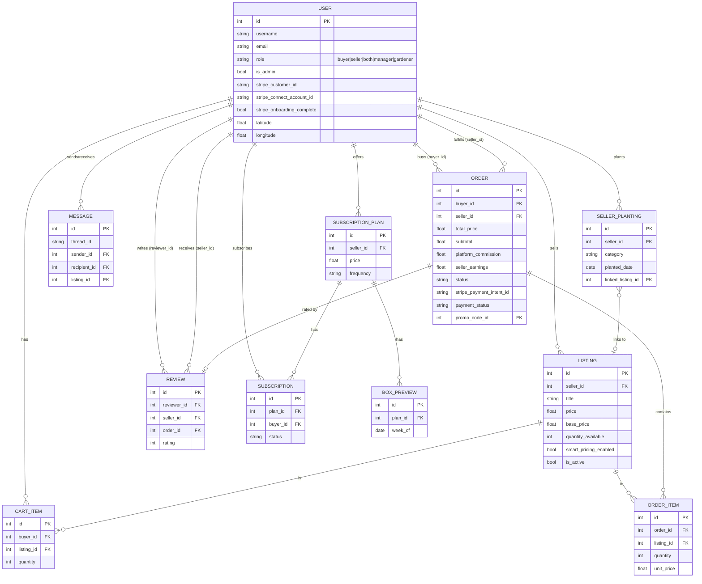
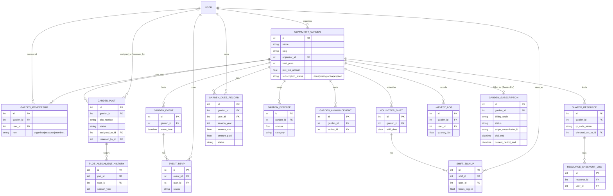
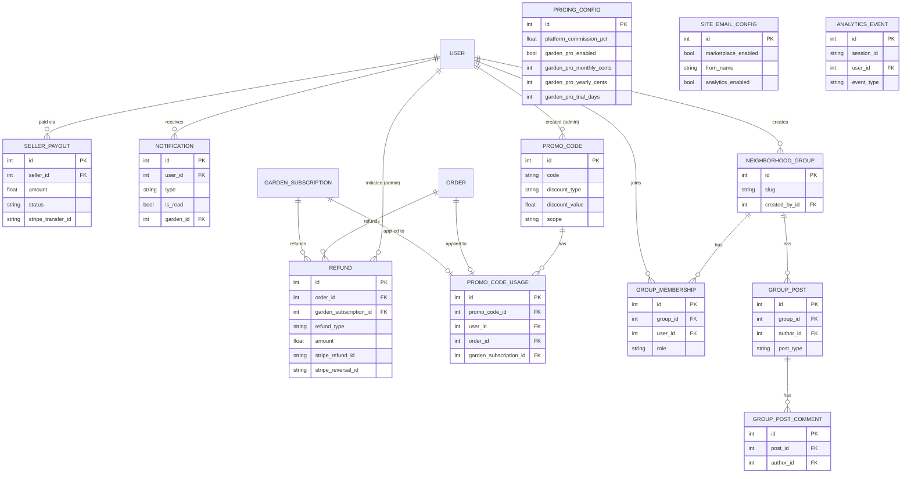

# 03 - Data Model (ERD)

Entity-relationship diagram of the core SQLAlchemy models in `app/models.py`.
Only the load-bearing columns and relationships are shown. The model set is
split into two ER diagrams (Marketplace and Community Gardens) for readability,
both centered on `User`. A third diagram covers cross-cutting billing/platform
entities.

## Marketplace domain

## Community gardens domain

## Platform / billing / cross-cutting

## Notes

- `PRICING_CONFIG` and `SITE_EMAIL_CONFIG` are effectively singletons (one row),
  queried with `.first()`. `SITE_EMAIL_CONFIG.marketplace_enabled` is the master
  flag toggling the marketplace vs garden-only product surface.
- `REFUND` and `PROMO_CODE_USAGE` each polymorphically reference either an
  `ORDER` (marketplace) or a `GARDEN_SUBSCRIPTION` (Garden Pro) via nullable FKs.
- Additional smaller models exist (e.g. `GardenWaitlist`, `GardenWeatherAlert`,
  `GardenMessage`, `GardenPhoto`/`GardenPhotoComment`/`GardenPhotoLike`,
  `GardenEmailConfig`, `GardenKnowledgeArticle`, `GardenLayoutDraft`,
  `HarvestInterest`, `PlantingGuide`, `Photo`) — omitted here to keep the
  diagrams readable.
