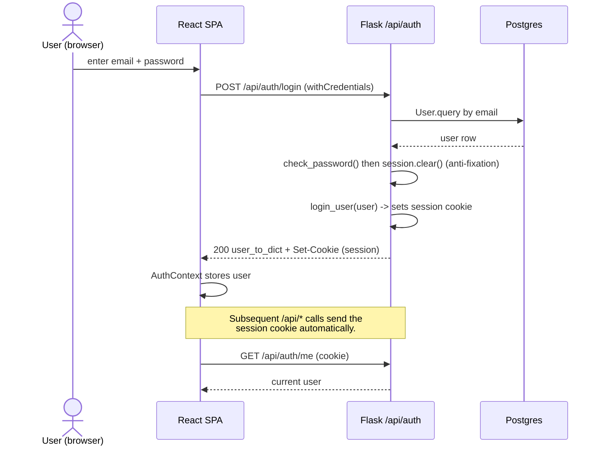
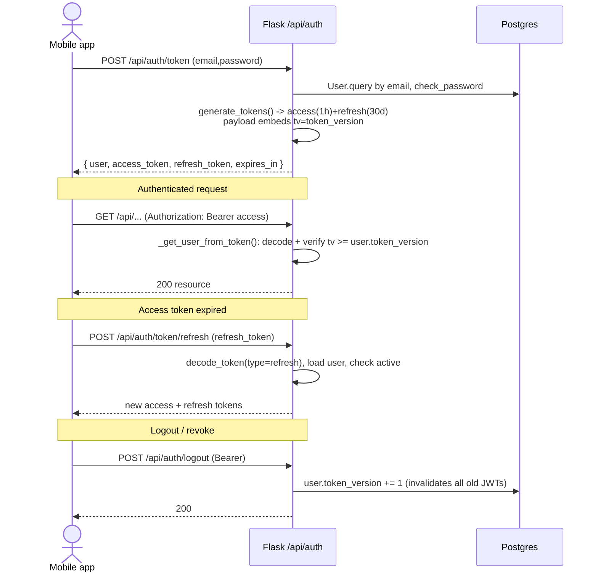
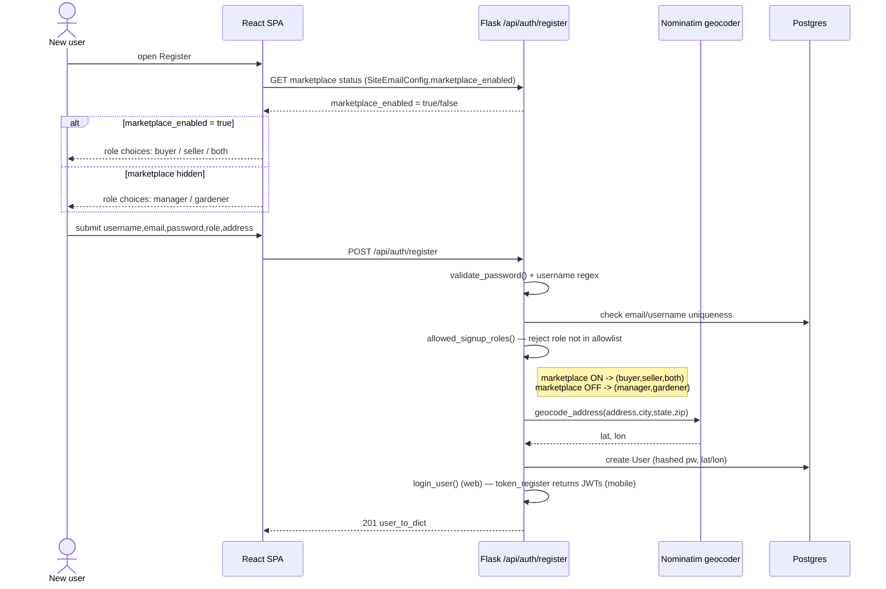

# 04 - Authentication Flows

YardHarvest supports two auth mechanisms against the same API:
- **Web**: Flask-Login session cookies (SameSite=Lax, HttpOnly, Secure in prod).
- **Mobile**: JWT access (1h) + refresh (30d) tokens via `Authorization: Bearer`.

The `@token_or_session` decorator and `get_current_user()` accept either, so
most endpoints serve both clients.

## Web session login

## Mobile JWT login + refresh

## Role-gated registration (marketplace hidden)

The allowed signup roles depend on the admin `marketplace_enabled` flag in
`SiteEmailConfig`. When the marketplace is hidden, signup offers only the two
garden roles.

## Notes

- Origin-header validation (`before_request` in `app/__init__.py`) protects
  state-changing `/api/*` requests; Bearer-token requests skip it.
- Password reset uses a single-use JWT that embeds the first 16 chars of the
  password hash — once the password changes, old reset links stop verifying.
