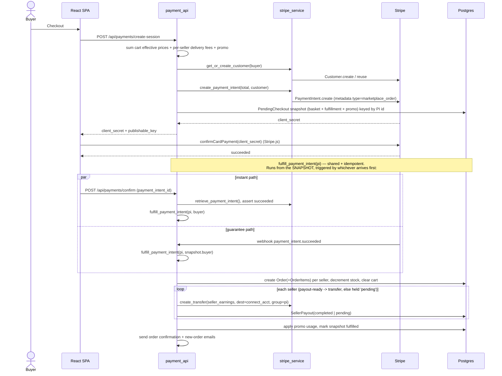
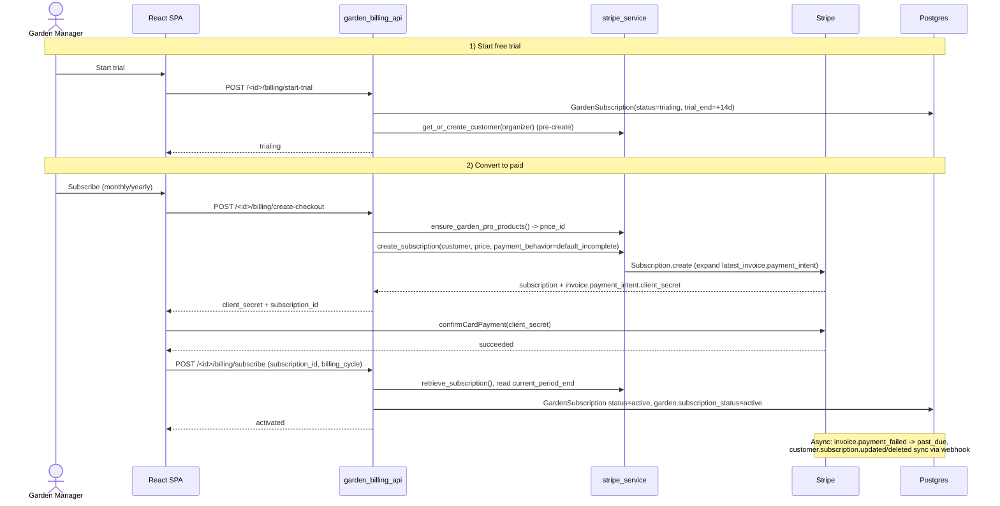
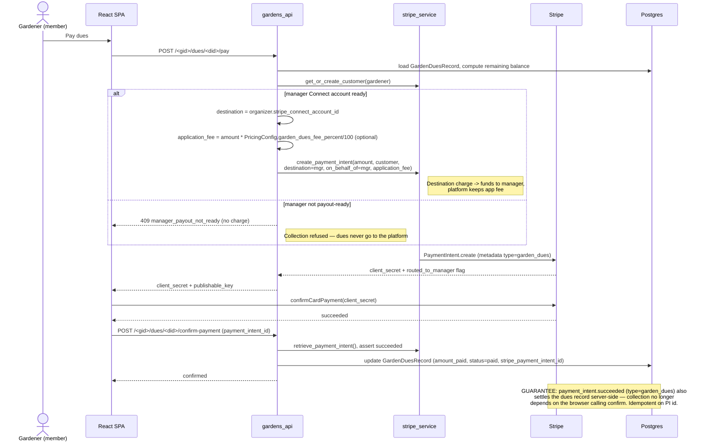
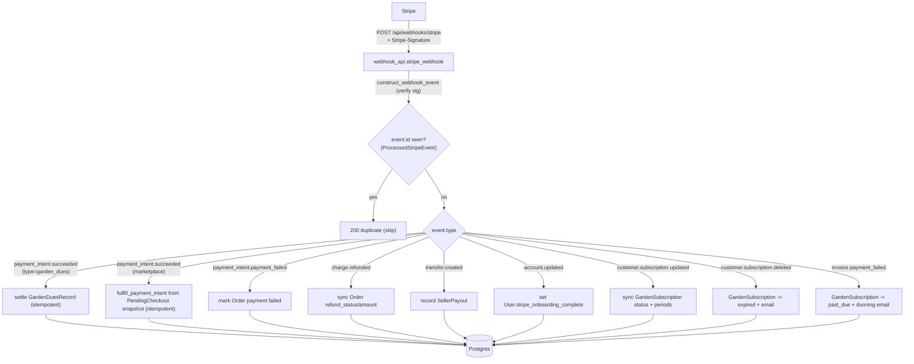

# 05 - Payment Flows

All Stripe calls flow through `app/stripe_service.py`. There are three distinct
money flows, plus a shared webhook path. In dev (no `STRIPE_SECRET_KEY`) each
endpoint returns a `dev_mode` response and skips Stripe — so **production must
set `STRIPE_SECRET_KEY` / `STRIPE_PUBLISHABLE_KEY` / `STRIPE_WEBHOOK_SECRET`
(+ `APP_URL`)** or the UI shows the dev "Test Payment" placeholder and no money
moves.

Seller and garden-manager payouts use **Stripe Connect Express** accounts
(`ensure_connect_account` → `Account.create(type='express', capabilities=
{card_payments, transfers, us_bank_account_ach_payments})` — the ACH capability
lets members pay dues by bank, since the connected account is merchant-of-record
on dues). Onboarding is **embedded in-app** by default via
`create_account_session()` (Stripe Connect embedded components, rendered by
`StripeConnectOnboarding.jsx`), with Stripe-**hosted** `AccountLink`
(`create_connect_account_link`) as the automatic fallback when the embedded
component can't load. An Express dashboard `login_link` is offered once
`charges_enabled && payouts_enabled`.

> The embedded components load `Connect.js` from `connect-js.stripe.com`, so the
> CSP in `app/__init__.py` must allow that host in `script-src`/`frame-src` plus
> `connect-src` (also `merchant-ui-api.stripe.com`) — see `06-deployment.md`.

**Self-healing ids (test→live cutover):** `ensure_connect_account` and
`get_or_create_customer` recreate a stored Connect/customer id when Stripe
rejects it with `InvalidRequestError` *or* `PermissionError` (e.g. a leftover
test-mode id under live keys); `create_connect_account_link` /
`create_account_session` additionally reset + retry once if the account link
itself is rejected. This makes the test→live key switch seamless.

## (a) Marketplace checkout + seller payout

`payment_api` (`/api/payments`). The platform takes a commission; the seller's
share is sent as a Stripe **Transfer** to their connected account (separate
charges-and-transfers model).

## (b) Garden Pro trial -> subscription (Stripe Subscriptions)

`garden_billing_api` (`/api/gardens/<id>/billing`). Trial requires no payment.
Conversion uses a `default_incomplete` Subscription whose latest invoice's
PaymentIntent the client confirms, then the backend activates the record.

## (c) Garden dues -> manager Connect destination charge

`gardens_api` (`/api/gardens/<id>/dues/<id>/pay`). Dues are charged **on behalf
of** and routed **directly to the garden manager's** connected account
(destination charge), with an optional platform `application_fee`
(admin-editable `PricingConfig.garden_dues_fee_percent`, with the legacy
`GARDEN_DUES_FEE_PERCENT` env var as fallback). Behavior when the manager **isn't** payout-ready is controlled by the admin
switch **`PricingConfig.dues_require_payout_ready`** (Admin → Pricing →
"Require payout setup before collecting dues", default **ON**):
- **ON** — collection is **refused with `409` (`reason: manager_payout_not_ready`)**
  so dues are never charged to the platform; every successful charge routes to
  the manager. The garden admin dashboard's "Finish account payout set-up"
  banner prompts the manager to onboard.
- **OFF** — dues fall back to a plain platform charge so collection always works
  (those funds land with the platform until reconciled to the manager manually).

## Shared webhook path

`POST /api/webhooks/stripe` (`webhook_api`). Signature is verified via
`STRIPE_WEBHOOK_SECRET`; events are dispatched through an `EVENT_HANDLERS` map.

## Notes

- Marketplace uses **separate charges & transfers** (platform charge + later
  `Transfer`), while garden dues use a **destination charge**
  (`transfer_data.destination` + `on_behalf_of`) — two different Connect models
  in the same codebase.
- Refunds (`refund_api`, admin) issue `Refund.create` for marketplace orders and
  may `reverse_transfer` the seller payout; Garden Pro refunds cancel/refund the
  subscription. The `charge.refunded` webhook also back-syncs dashboard refunds.
- **Idempotency:** every webhook event id is recorded in `ProcessedStripeEvent`
  (UNIQUE); redeliveries short-circuit with `200 duplicate`. An event is only
  recorded after its handler succeeds, so a failing handler returns 500 and
  Stripe retries. Handlers are also individually idempotent (guard on current
  state) as defense-in-depth.
- **Payout holds:** marketplace transfers only fire when the seller's Connect
  account is fully payout-ready; otherwise a `SellerPayout(status='pending')`
  records the amount owed (surfaced in Grower Earnings) instead of the platform
  silently keeping it. Managers reach Connect onboarding via the admin portal
  "Billing & Payouts" link, and the garden admin dashboard shows a "Finish
  account payout set-up" banner while `payoutStatus` is `configured && !ready`.
- **Payment methods are restricted to card + `us_bank_account` (ACH) only** via
  explicit `payment_method_types` (no Amazon Pay / Cash App Pay / Klarna). ACH on
  a destination charge is gated on the connected account actually having the
  capability active (`connect_payment_method_types`), so dues collection never
  breaks if ACH isn't enabled.
- **Go-live health probe:** `GET /api/health/stripe` reports `{mode, configured,
  auth_ok, connect_ok, error}` — `mode` is `live`/`test` from the key prefix,
  `auth_ok` proves the secret key authenticates (`Balance.retrieve`), and
  `connect_ok` proves Connect is enabled (`Account.list`). This is the canonical
  way to verify a key swap landed. (Note: `connect_ok` only proves listing works,
  not that Express account *creation* is enabled — an incomplete Connect platform
  profile surfaces only when onboarding actually runs.)
- **Webhook-guaranteed marketplace fulfillment:** at `create-session` a
  `PendingCheckout` snapshot (basket + per-seller fulfillment + promo) is stored
  keyed by the PaymentIntent. Orders are created by the shared
  `payment_api.fulfill_payment_intent`, called by **both** the client `/confirm`
  (instant) and the `payment_intent.succeeded` webhook (guarantee), reading the
  snapshot so the order matches exactly what was charged. Idempotent (per-PI
  order guard), so a browser death between pay and confirm can no longer leave a
  charge without orders. Dev mode (no snapshot) falls back to the live cart.
