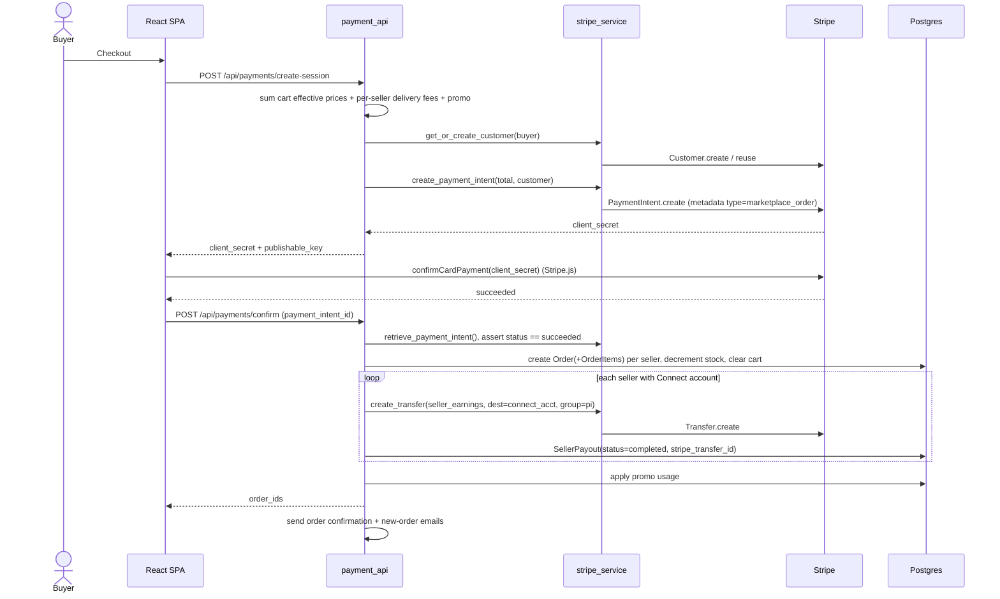
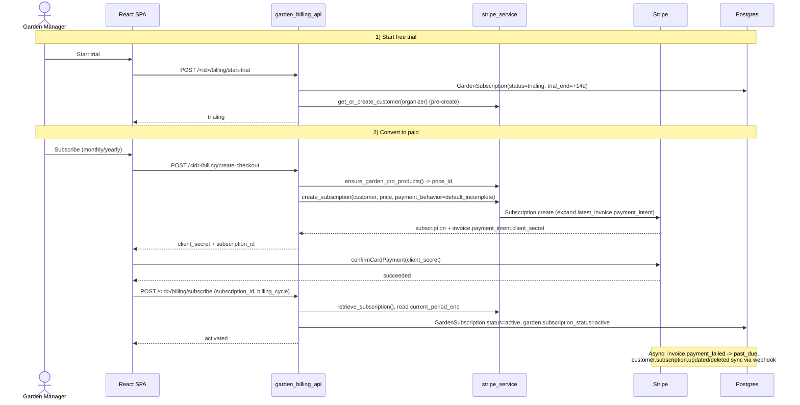
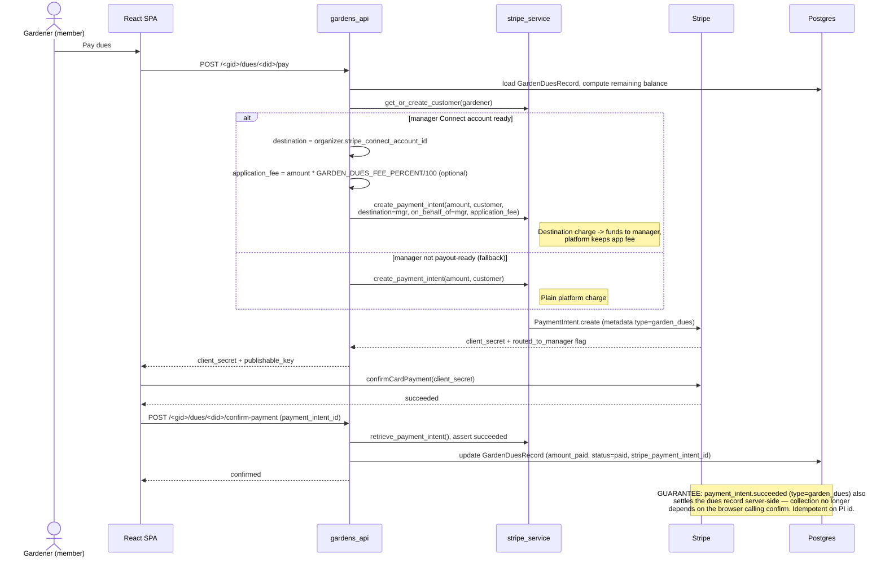
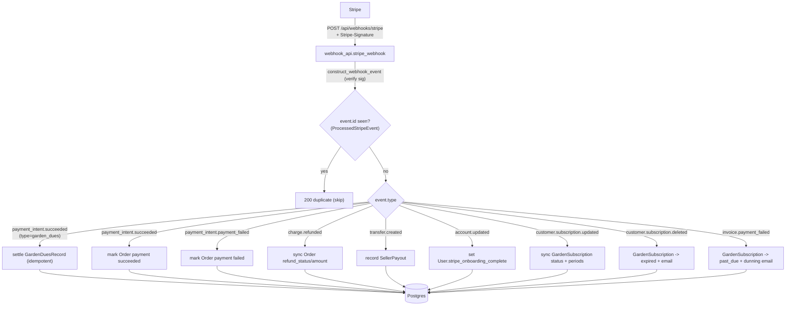

# 05 - Payment Flows

All Stripe calls flow through `app/stripe_service.py`. There are three distinct
money flows, plus a shared webhook path. In dev (no `STRIPE_SECRET_KEY`) each
endpoint returns a `dev_mode` response and skips Stripe — so **production must
set `STRIPE_SECRET_KEY` / `STRIPE_PUBLISHABLE_KEY` / `STRIPE_WEBHOOK_SECRET`
(+ `APP_URL`)** or the UI shows the dev "Test Payment" placeholder and no money
moves.

Seller and garden-manager payouts use **Stripe Connect Express** accounts
(`create_connect_account_link` → `Account.create(type='express', capabilities=
{card_payments, transfers})`): Stripe-hosted onboarding via `AccountLink`, and
an Express dashboard `login_link` once `charges_enabled && payouts_enabled`.

## (a) Marketplace checkout + seller payout

`payment_api` (`/api/payments`). The platform takes a commission; the seller's
share is sent as a Stripe **Transfer** to their connected account (separate
charges-and-transfers model).

## (b) Garden Pro trial -> subscription (Stripe Subscriptions)

`garden_billing_api` (`/api/gardens/<id>/billing`). Trial requires no payment.
Conversion uses a `default_incomplete` Subscription whose latest invoice's
PaymentIntent the client confirms, then the backend activates the record.

## (c) Garden dues -> manager Connect destination charge

`gardens_api` (`/api/gardens/<id>/dues/<id>/pay`). Dues are charged **on behalf
of** and routed **directly to the garden manager's** connected account
(destination charge), with an optional platform `application_fee`
(`GARDEN_DUES_FEE_PERCENT`). If the manager has no payout-ready Connect account,
it falls back to a plain platform charge so collection still works.

## Shared webhook path

`POST /api/webhooks/stripe` (`webhook_api`). Signature is verified via
`STRIPE_WEBHOOK_SECRET`; events are dispatched through an `EVENT_HANDLERS` map.

## Notes

- Marketplace uses **separate charges & transfers** (platform charge + later
  `Transfer`), while garden dues use a **destination charge**
  (`transfer_data.destination` + `on_behalf_of`) — two different Connect models
  in the same codebase.
- Refunds (`refund_api`, admin) issue `Refund.create` for marketplace orders and
  may `reverse_transfer` the seller payout; Garden Pro refunds cancel/refund the
  subscription. The `charge.refunded` webhook also back-syncs dashboard refunds.
- **Idempotency:** every webhook event id is recorded in `ProcessedStripeEvent`
  (UNIQUE); redeliveries short-circuit with `200 duplicate`. An event is only
  recorded after its handler succeeds, so a failing handler returns 500 and
  Stripe retries. Handlers are also individually idempotent (guard on current
  state) as defense-in-depth.
- **Payout holds:** marketplace transfers only fire when the seller's Connect
  account is fully payout-ready; otherwise a `SellerPayout(status='pending')`
  records the amount owed (surfaced in Grower Earnings) instead of the platform
  silently keeping it. Managers reach Connect onboarding via the admin portal
  "Billing & Payouts" link.
- **Known follow-up:** marketplace *order creation* still happens in the client
  `/confirm` call (idempotent, but if the buyer's browser dies between payment
  and confirm, no order is created despite the charge). The dues flow is already
  webhook-guaranteed; the marketplace should get the same treatment via a
  checkout snapshot fulfilled from `payment_intent.succeeded`.
