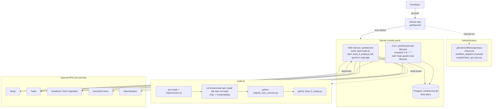
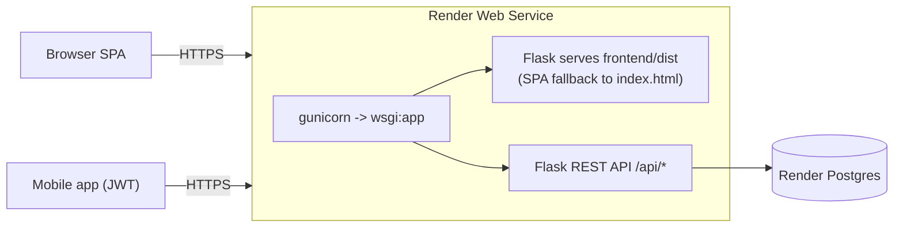

# 06 - Deployment Topology

YardHarvest is deployed on **Render** via `render.yaml` (Blueprint/IaC). One
GitHub repo drives a web service, a cron job, and a managed Postgres database.

## Runtime topology

## Environment & secrets

| Variable | Set by | Used for |
|---|---|---|
| `DATABASE_URL` | Render (fromDatabase) | Postgres connection (`postgres://` rewritten to `postgresql://`); also the prod flag (enables Secure cookies, HSTS) |
| `SECRET_KEY` | Render (`generateValue` web; `sync:false` cron) | Flask session signing; **fatal if missing in prod** |
| `JWT_SECRET_KEY` | env (defaults to `SECRET_KEY + '-jwt'`) | JWT signing |
| `PYTHON_VERSION` / `NODE_VERSION` | render.yaml | 3.11.6 / 20 build toolchain |
| `FLASK_APP=wsgi:app` | render.yaml (cron) | CLI entrypoint for `flask garden-trial-lifecycle` |
| `STRIPE_SECRET_KEY`, `STRIPE_PUBLISHABLE_KEY`, `STRIPE_WEBHOOK_SECRET` | secrets | Stripe payments + webhook verification |
| `TWILIO_ACCOUNT_SID/AUTH_TOKEN/PHONE_NUMBER` | secrets | SMS |
| `SENDGRID_API_KEY`, `ZEPTOMAIL_TOKEN`, `ZEPTOMAIL_API_URL`, `MAIL_DEFAULT_SENDER` | secrets/env | Email (SendGrid preferred, Zoho ZeptoMail API fallback). Both are HTTPS APIs — no SMTP credentials. |
| `DOORDASH_DEVELOPER_ID/KEY_ID/SIGNING_SECRET` | secrets | DoorDash Drive JWT |
| `OPENWEATHER_API_KEY` | secret | Weather forecasts |
| `CORS_ORIGINS`, `RENDER_EXTERNAL_URL`, `APP_URL` | env | CORS/Origin allowlist, Stripe return URLs |
| `GARDEN_TRIAL_DAYS`, `GARDEN_PRO_PRICE_MONTHLY/YEARLY` | env | Garden Pro defaults (also admin-editable in `PricingConfig`) |
| `GARDEN_DUES_FEE_PERCENT` | env (fallback) | Dues platform fee — now admin-editable via Admin → Pricing (`PricingConfig.garden_dues_fee_percent`); env used only if unset |
| `MARKETING_API_KEY` | secret | Token gate for `/crm/api/marketing/*` (used by `marketing_agent` CLI). Unset → API returns 503. |

## Notes

- The cron job and web service are **separate Render services sharing the same
  Postgres**. The cron runs daily at 08:00 UTC and handles trial expiry,
  cancelled-subscription expiry, and day 3/7/12/14/21 onboarding emails/SMS.
- The internal CRM previously ran as its own Render web service
  (`yardharvest-crm`) on its own Postgres (`yardharvest-crm-db`). It was
  consolidated into the main yardharvest web service at `/crm/*` (see
  [07-crm-module.md](07-crm-module.md)). After migrating data with
  `scripts/migrate_crm_data.py`, the standalone CRM service and database can
  be deleted from the Render dashboard. The `crm.yardharvest.app` subdomain
  is kept as an alias-domain on the consolidated service so existing URLs
  stay valid.
- A second CLI command, `analytics-cleanup`, exists for retention-based purging
  of `AnalyticsEvent` rows but is **not wired into render.yaml** as a cron (would
  need its own scheduled service).
- `api-keys-check.yml` is manual (`workflow_dispatch`) and only validates that
  third-party credentials in repo secrets are usable; it is not part of CI/CD.
