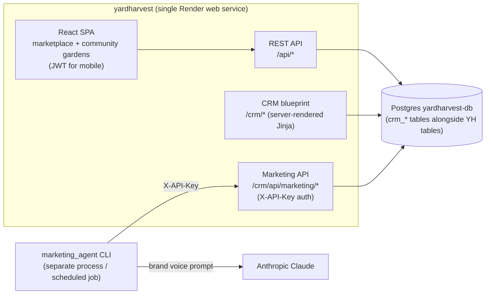
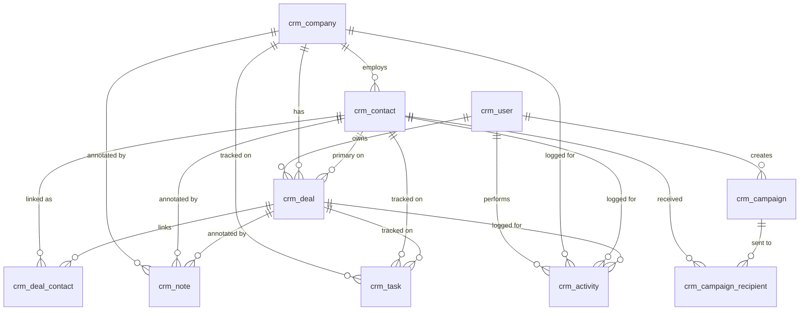

# 07 — CRM Module

The CRM is an internal sales-pipeline tool used by the YardHarvest team to
track community-garden / city-parks prospects. It is mounted on the main
yardharvest Flask app under `/crm/*` and shares its Postgres database with the
marketplace + community-gardens product, with all CRM tables prefixed `crm_`.

This module was previously a standalone Flask app (the `yardharvest-crm` Render
service backed by a separate `yardharvest-crm-db` database) and was
consolidated to eliminate the second web service + DB.

## High-level layout



## Routes

Mounted from `app/crm/__init__.py` via:

```python
crm_bp = Blueprint('crm', __name__, url_prefix='/crm',
                   static_folder='../static/crm',
                   static_url_path='/crm/static')
```

| Path | View | Purpose |
|---|---|---|
| `/crm/` → `/crm/dashboard` | `crm.dashboard` | Pipeline overview, open tasks, seasonal tip |
| `/crm/companies`, `/crm/companies/new`, `/crm/companies/<id>` | `crm.list_companies` / `crm.new_company` / `crm.company_detail` | Organization CRUD |
| `/crm/contacts`, `/crm/contacts/<id>`, `/crm/contacts/<id>/email` | `crm.list_contacts` / `crm.view_contact` / `crm.email_contact` | Contact CRUD + one-off email |
| `/crm/deals`, `/crm/deals/new`, `/crm/deals/<id>`, `/crm/kanban` | `crm.list_deals` / `crm.new_deal` / `crm.deal_detail` / `crm.kanban` | Deal CRUD + Kanban board |
| `/crm/tasks` | `crm.list_tasks` | Cross-entity task list |
| `/crm/reports`, `/crm/export/companies.csv`, `/crm/export/deals.csv` | `crm.reports` / `crm.export_*` | Pipeline analytics + CSV exports |
| `/crm/templates`, `/crm/campaigns`, `/crm/campaigns/new` | `crm.list_templates` / `crm.list_campaigns` / `crm.new_campaign` | Email-template library + campaign sender |
| `/crm/login`, `/crm/register`, `/crm/logout`, `/crm/admin`, `/crm/users` | `crm.login` / `crm.register` / `crm.logout` / `crm.admin_portal` / `crm.list_users` | Auth + admin |
| `/crm/api/marketing/stats`, `/segments`, `/audience`, `/merge-fields`, `/campaigns` | `crm.api_*` | Token-auth API for `marketing_agent` CLI |

## Auth model

The CRM uses **session-based auth that is separate from YH's Flask-Login**.
This avoids merging the two user tables (which have different schemas and roles
— YH has `buyer/seller/manager/gardener`, the CRM has `admin/member/readonly`).

- Login: `POST /crm/login` → sets `session['_crm_user_id']`.
- `current_user` in CRM templates is a thin proxy
  (`app/crm/helpers.py::_CrmCurrentUser`) that reads the session and lazy-loads
  the `CrmUser` row. It exposes the same interface as Flask-Login's
  `current_user` (`is_authenticated`, `is_admin`, `username`, etc.) so the 36
  lifted templates work unchanged.
- `@crm_bp.before_request` enforces login for every CRM route except
  `/crm/login`, `/crm/register`, `/crm/static`, and `/crm/api/*` (the API uses
  X-API-Key auth).
- YH's Flask-Login `unauthorized_handler` redirects `/crm/*` requests to
  `/crm/login` (as a defense in depth — the CRM blueprint's own auth gate
  should catch unauthenticated requests first).

## Schema (tables prefixed `crm_*`)



All CRM tables are created by `db.create_all()` on first boot (the CRM models
import is triggered by `from app.crm import crm_bp` during `create_app()`).

## Email backend

CRM email composition / campaign sends route through YH's shared
`app/email_service.py::send_email`, which sends via Zoho ZeptoMail's
transactional API (the platform's sole email provider; HTTPS API, no SMTP).
`send_email` returns a success bool, so the CRM records "Email sent" vs
"Email logged" accurately, and campaigns use ZeptoMail's batch endpoint. The
CRM never had its own email integration beyond a Flask-Mail stub; this
consolidation upgrades it.

## Marketing API + agent

The token-authenticated marketing API at `/crm/api/marketing/*` is gated by
`current_app.config['MARKETING_API_KEY']`. The companion CLI is in
`marketing_agent/agent.py`:

- Reads audience + segments from the API
- Calls Claude (Anthropic SDK) with a stable brand-voice system prompt
  (prompt-cached) to draft personalized campaigns
- POSTs the result back as a `status='draft'` campaign — never auto-sends
- A human reviews + sends from the `/crm/campaigns/new` UI

Env vars for the CLI: `ANTHROPIC_API_KEY`, `MARKETING_API_KEY`, `CRM_BASE_URL`
(defaults to `http://127.0.0.1:5000`; the CLI appends `/crm/api/marketing/*`).

## Migration from the old standalone CRM

The standalone CRM's database has natural table names (`user`, `company`,
`contact`, etc.). The consolidated app uses `crm_user`, `crm_company`,
`crm_contact`, etc. Use `scripts/migrate_crm_data.py` to dump from the old DB
and load into the new one with the rename applied:

```sh
python scripts/migrate_crm_data.py \
    --source $CRM_DATABASE_URL \
    --target $YH_DATABASE_URL \
    --execute
```

Runs in DRY mode by default; pass `--execute` to commit. Truncates each target
`crm_*` table before insert (pass `--no-truncate` to append). Resets each
table's identity sequence to `MAX(id) + 1` so subsequent inserts don't collide.

## Out-of-band considerations

- **CSP** — the strict app-wide CSP allows only `'self'` + jsdelivr/Stripe for
  `script-src`. The CRM templates use inline `onclick` / `onchange` /
  `onsubmit` handlers lifted from the standalone app, so the CSP middleware
  (`app/__init__.py::set_security_headers`) loosens `script-src` to include
  `'unsafe-inline'` *only* for `/crm/*` paths. The public marketplace SPA
  keeps the strict policy.
- **CSRF** — the CRM blueprint inherits Flask-WTF CSRF protection for its HTML
  forms (every template includes `{{ csrf_token() }}`). The five JSON
  marketing API endpoints are individually `csrf.exempt()`-ed in `create_app()`
  because they're token-auth, not session+form auth.
- **Subdomain** — the old `crm.yardharvest.app` subdomain is intended to be
  kept as a Render alias on the consolidated yardharvest service so existing
  bookmarks keep working. (Render alias-domain config is dashboard-only; not
  in `render.yaml`.)
- **Uploads** — contact photos and CSV import data land under
  `<UPLOAD_FOLDER>/crm/` so they're segregated from YH product uploads.
