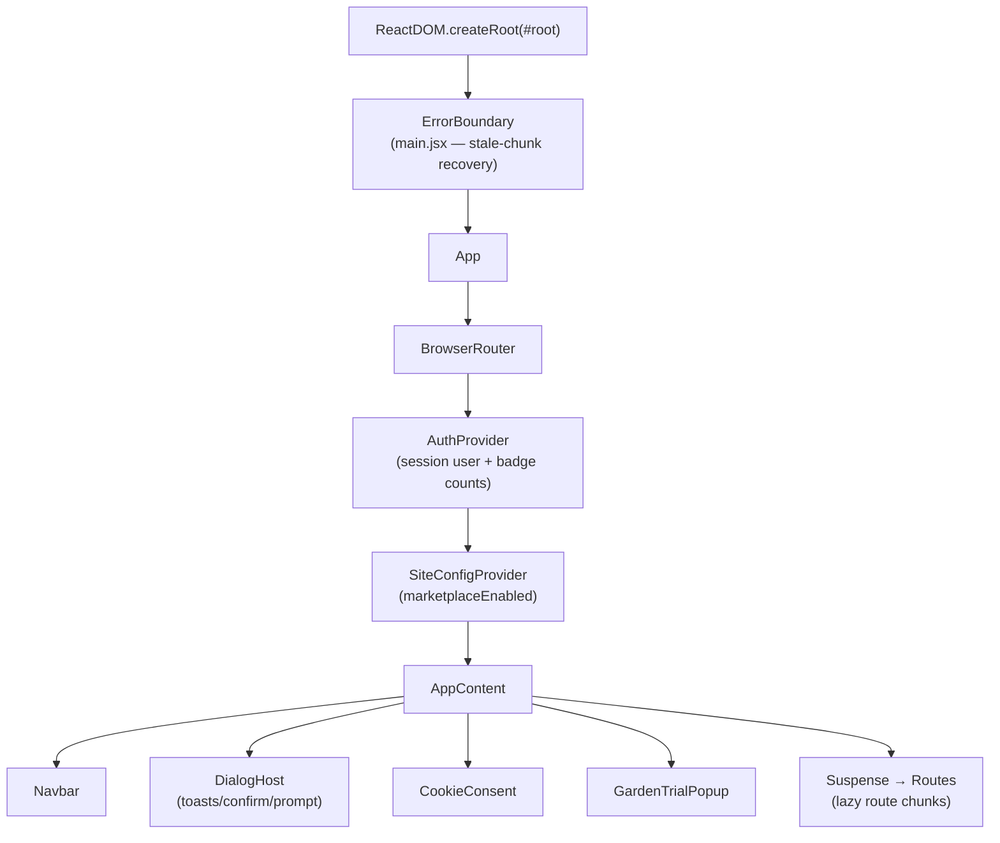

# 08 — Frontend (React SPA)

The public product (marketplace + community gardens) is a **React 19 + Vite**
single-page app under [`frontend/`](../../frontend). It talks to the Flask REST
API over `/api/*` with session cookies, and in production is served as static
files from `frontend/dist` by the same Flask process (single origin, SPA
fallback to `index.html` — see [06-deployment.md](06-deployment.md)). The
internal CRM at `/crm/*` is **not** part of this SPA; it is server-rendered
Jinja (see [07-crm-module.md](07-crm-module.md)).

## Composition (provider tree)

`main.jsx` mounts `<App>` inside a class `ErrorBoundary`; `App.jsx` nests the
providers and renders `AppContent` (chrome + routed `<main>`).



## Routing & gating

Routes live in [`src/App.jsx`](../../frontend/src/App.jsx). Only `Home` and
`NotFound` are eagerly imported; every other page is `React.lazy` code-split, so
heavy routes (GardenAdminDashboard, Leaflet maps, the QR scanner, Stripe
checkout, admin) download only when visited. A `<Suspense>` shows a spinner
fallback during chunk load.

Three independent gates compose:

| Gate | Where | Effect |
|---|---|---|
| `mktGuard(element)` | `App.jsx` (reads `useSiteConfig`) | If `marketplaceEnabled` is false, renders `<Navigate to="/gardens" replace />` instead of the element. Applied to all marketplace routes. |
| `<ProtectedRoute>` | [`components/ProtectedRoute.jsx`](../../frontend/src/components/ProtectedRoute.jsx) | Shows a spinner while `auth.loading`; redirects unauthenticated users to `/login` with `state.from` preserved for post-login return. |
| `requireSeller` / `requireAdmin` | prop on `ProtectedRoute` | `requireSeller` blocks unless `user.can_sell` (shows a "Become a Grower" prompt → `/profile/edit`); `requireAdmin` blocks unless `user.is_admin` (shows "Access Denied"). |

`mktGuard` and `ProtectedRoute` are layered for marketplace seller/buyer routes
(e.g. `/checkout` is `mktGuard(<ProtectedRoute>…)`). Role-gating is **UX only** —
the backend independently authorizes every request, so a hidden marketplace or a
non-seller hitting the API directly is still rejected server-side.

### Route map by surface

- **Public (no auth):** `/`, `/about`, `/pricing`, `/listings/:id`,
  `/profile/:userId`, `/login`, `/register`, `/forgot-password`,
  `/reset-password`, `/verify-email-change`, `/groups` + `/groups/:id`,
  `/planting-calendar`, `/harvest-forecast`, `/planting-guide/:category`,
  `/gardens`, `/gardens/:id`, `/gardens/:id/events`, `/gardens/:id/impact`,
  `/gardens/:id/resources/:resId/scan`.
- **Marketplace (mktGuard):** `/browse`, `/search`, `/subscriptions` +
  `/subscriptions/plans/:id`; seller-only (`requireSeller`) `/listings/create`,
  `/my-listings`, `/dashboard`, `/seller/orders`, `/seller/subscriptions`,
  `/earnings`, `/subscriptions/create`; buyer (`ProtectedRoute`) `/cart`,
  `/checkout`, `/orders`, `/orders/:id`, `/orders/:id/review`,
  `/my-subscriptions`.
- **Community gardens (always on):** `/gardens/create`, `/gardens/my-gardens`,
  `/gardens/:id/admin`, `/gardens/:id/billing` (all `ProtectedRoute`; the admin
  + billing pages further check organizer/role on the backend).
- **Messaging / profile (auth):** `/messages`, `/messages/thread/:threadId`,
  `/messages/new/:userId`, `/profile/edit`, `/notifications/preferences`,
  `/my-planting-log`, `/groups/create`.
- **Admin (`requireAdmin`):** `/admin`, `/admin/users`, `/admin/listings`,
  `/admin/orders`, `/admin/pricing`, `/admin/email-settings`, `/admin/stats`,
  `/admin/gardens`, `/admin/refunds`, `/admin/promos`, `/admin/analytics`.

The footer tagline and the Navbar marketplace dropdown/cart also switch on
`marketplaceEnabled` (garden-only mode shows *"Less admin, more garden"*).

## Auth state — `AuthContext`

[`src/AuthContext.jsx`](../../frontend/src/AuthContext.jsx) is the single source
of session truth. There is **no token handling in the browser** — auth rides on
the HttpOnly session cookie that the backend sets, and Axios sends it
automatically (`withCredentials`).

- On mount, `fetchUser()` calls `GET /api/auth/me`; on success it stores `user`
  and kicks off `refreshCounts()`. `loading` stays true until this resolves
  (ProtectedRoute renders a spinner meanwhile).
- `login` / `register` POST and set `user`; `logout` POSTs and clears `user` +
  all counts.
- Badge counts (`cartCount`, `unreadCount` messages, `notifCount`
  notifications) are fetched in parallel by `refreshCounts()`; the notification
  count additionally **polls every 30s** while logged in.
- Exposed via `useAuth()`.

The mobile JWT flow (access/refresh, `token_version` revocation) exists in the
API for native clients but is unused by this SPA — see
[04-auth-flow.md](04-auth-flow.md).

## Marketplace flag — `SiteConfigContext`

[`src/SiteConfigContext.jsx`](../../frontend/src/SiteConfigContext.jsx) fetches
`GET /api/admin/site-config` once on load and exposes `{ marketplaceEnabled }`
via `useSiteConfig()`. It defaults to **false** (garden-only) until the fetch
resolves, so the marketplace never flashes before the flag is known. This is the
client mirror of the `SiteEmailConfig.marketplace_enabled` master flag.

## HTTP client — `api.js`

[`src/api.js`](../../frontend/src/api.js) creates one Axios instance:

```js
axios.create({ baseURL: '/api', withCredentials: true,
               headers: { 'Content-Type': 'application/json' } })
```

- All calls are relative to `/api`; in dev the Vite server proxies `/api` (and
  `/static`) to Flask on `:5000`, in prod they're same-origin.
- File uploads (listing/profile/photo) override the header to
  `multipart/form-data`.
- Endpoints are grouped into named objects mirroring the backend blueprints:
  `authAPI`, `listingsAPI`, `cartAPI`, `paymentAPI`, `ordersAPI`,
  `messagesAPI`, `profileAPI`, `adminAPI`, `promoAPI`, `subscriptionsAPI`,
  `plantingAPI`, `groupsAPI`, `gardenBillingAPI`, `gardensAPI`,
  `gardenAdminAPI`, `notificationsAPI`, `earningsAPI`, `photosAPI`,
  `publicAPI`.
- `IMAGE_BASE = '/media/'`: every stored image reference (a local filename in
  dev or a Cloudinary `public_id` in prod) is rendered as `` `${IMAGE_BASE}${ref}` ``
  and resolved by the backend `/media/<ref>` route (local file, else 301 to the
  Cloudinary CDN). Absolute external URLs (e.g. `listing.image_url` seed data)
  bypass this.

## Stripe.js on the client

Three distinct client integrations correspond to the three backend money flows
([05-payments.md](05-payments.md)):

- **Marketplace checkout** — [`pages/Checkout.jsx`](../../frontend/src/pages/Checkout.jsx)
  mounts `@stripe/react-stripe-js` Elements with a `PaymentElement` and confirms
  via `stripe.confirmPayment({ redirect: 'if_required' })`. A dev-mode "Test
  Payment" button short-circuits when Stripe isn't configured.
- **Garden Pro subscription** — [`components/GardenPaymentModal.jsx`](../../frontend/src/components/GardenPaymentModal.jsx)
  mounts a Card Element and confirms the subscription's invoice PaymentIntent.
- **Manager payout onboarding** — [`components/StripeConnectOnboarding.jsx`](../../frontend/src/components/StripeConnectOnboarding.jsx)
  renders Stripe's **embedded Connect** components via `loadConnectAndInitialize`
  with a `fetchClientSecret` callback (account session). It is wrapped in a local
  crash boundary and calls `onError` so the caller can fall back to Stripe's
  **hosted** onboarding link. (This is why the CSP must allow
  `connect-js.stripe.com` / `merchant-ui-api.stripe.com`.)

The publishable key is returned by the API at runtime, so a Stripe key swap
needs no frontend rebuild.

## In-app dialogs — replacing `window.alert/confirm/prompt`

[`components/dialog/dialogService.js`](../../frontend/src/components/dialog/dialogService.js)
is a tiny pub-sub store with an **imperative** API callable from anywhere (event
handlers, `.catch()` chains) without threading a hook:

- `toast(message, { type, duration })` — fire-and-forget, auto-dismiss.
- `confirmDialog(message, opts) → Promise<boolean>`.
- `promptDialog(message, opts) → Promise<string|null>`.
- `lightbox(src, opts)` — zoom an image in the same animated modal.

A single `<DialogHost />` mounted in `AppContent` subscribes and renders the
toasts/modals. This is the client analogue of the CRM's CSP-safe
`data-confirm` pattern — neither surface uses native blocking browser dialogs.

## Analytics & consent

First-party, consent-gated analytics:

- [`components/CookieConsent.jsx`](../../frontend/src/components/CookieConsent.jsx)
  reads `localStorage.yh_consent`. If unset, it checks
  `GET /api/analytics/config`; when `cookie_consent_required` is false it
  auto-accepts, otherwise it shows the banner. **Accept** stores `accepted` and
  mints a `yh_session_id` UUID; **Decline** stores `declined` and clears the
  session id. `hasConsent()` is the exported gate.
- [`hooks/useTracking.js`](../../frontend/src/hooks/useTracking.js) —
  `usePageTracking()` (called in `AppContent`) POSTs a `page_view` to
  `/api/analytics/event` on each path change; `trackEvent(type, metadata)` is
  the imperative form. Both no-op unless `hasConsent()` is true and **never throw**
  (analytics must not break the app). Events carry `session_id`, `page_url`,
  `referrer`, and a derived `device_type`.

## Resilience & build

- **Stale-chunk recovery** ([`main.jsx`](../../frontend/src/main.jsx)): each
  deploy rotates lazy-chunk hashes, so a long-open tab 404s on its next route
  import. `isChunkLoadError` + `reloadForStaleChunk` reload **once** (10s
  sessionStorage guard) on a failed dynamic import — surfaced via the
  `vite:preloadError` hook, the `unhandledrejection` listener, and the
  `ErrorBoundary` (which shows a calm *"Updating to the latest version…"* note
  instead of the red panel).
- **Boot error vs. runtime error**: the global `error`/`unhandledrejection`
  handlers only take over the page when `#root` never mounted; once React is
  running, stray async errors from third-party SDKs (e.g. the Stripe Connect
  iframe) are logged but don't blank the app.
- **Vite** ([`frontend/vite.config.js`](../../frontend/vite.config.js)): React
  plugin; prod sourcemaps off; dev server on `:5173` proxying `/api` + `/static`
  to `:5000`; Vitest configured (`jsdom`, `src/test/setup.js`) for the unit
  tests (`npm run test`).

## Source of truth

Derived from `frontend/src/` — `App.jsx` (routing), `main.jsx`,
`AuthContext.jsx`, `SiteConfigContext.jsx`, `api.js`, `components/`, `pages/`,
`hooks/useTracking.js`, and `vite.config.js`. If these change, update this doc.
